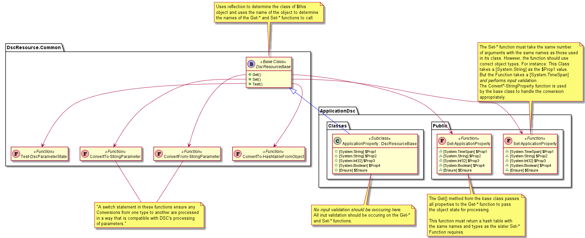

# Standardized Class-based DSC Module Architecture

The purpose of this architecture document is to propose a standard layout for DSC modules which allows for rapid creation of class-based resources by abstracting away some of the complexities and redundancies of resource creation.

The end result of this design is that a resource creator should only ever need to create 3 files to have a functional, high quality resource - and those files only need to focus on the properties, and the procedures for getting and setting those properties from the system.

> Obviously, examples and test will be needed too for a truly high quality resource. I'd like to think we could tackle that at a later date.

## Structure

The `DscResource.Common` PowerShell module provides a set of common functions to DscResources to accelerate their creation. This module would be leveraged in the same capacity to provide a base class from which all other class-based resources can inherit. The `DscResource.Common` module would also provide additional functions to provide all functionality for the Test() method of the base class and for standard class conversions that may be required (see DnsServerDsc/DnsRecordBase/TTL property for an example representing a TimeSpan as a String).

The new module would leverage the current structure provided by `Sampler` with specific usage:

- The `Classes` folder will hold the class files for each resource in the module.
  - Note: Classes should not do input validation. That should be left to the `Get-*` and `Set-*` functions instead (there is more flexibility in validation functionality with `Validate-Script`, etc.).
  - Note: managing localization data occurs here as well.
- The `Public` folder will contain Get and Set functions for each resource
  - For example, if the resource is named `ApplicationProperty`, then `Get-ApplicationProperty` and `Set-ApplicationProperty` would reside in the `Public` folder.
- The `Private` folder would be used for any functions called by the Get and Set functions which are specific to the functionality of this resource/module.

### Structure Diagram

## Process Flow

### Get()

When the LCM calls `Get()` on a given resource (in this scenario, the resource is named `ApplicationProperty`):

- the `Get()` method in the base class (from `DscResource.Common`) is called
- the base class calls the `ConvertFrom-StringParameter` function as many times as necessary to translate class types appropriately to pass parameters correctly in the next step
- the base class calls the `Get-ApplicationProperty` function in the resource module's `Public` folder
- `Get-ApplicationProperty` returns a hashtable representing the properties of the `ApplicationProperty` class
- the base class calls the `ConvertTo-StringParameter` function as many times as necessary to translate class types appropriately to populate fields correctly in the next step
- The `Get()` method of the base class creates an empty instance of `ApplicationProperty` and populates the fields with data from the hashtable
- The `ApplicationProperty` class returns the object to the LCM

#### Get() Sequence Diagram

> - Participants colored *green* are members of the `ApplicationDsc` module
> - Participants colored *blue* are members of the `DscResource.Common` module

### Set()

Likewise, when the LCM calls `Set()` on a given resource:

- the `Set()` method in the base class (from `DscResource.Common`) is called
- the base class calls the `ConvertFrom-StringParameter` function as many times as necessary to translate class types appropriately to pass parameters correctly in the next step
- the base class calls the `Set-ApplicationProperty` function in the resource module's `Public` folder
- `Set-ApplicationProperty` performs the set operation

#### Set() Sequence Diagram

> - Participants colored *green* are members of the `ApplicationDsc` module
> - Participants colored *blue* are members of the `DscResource.Common` module

### Test()

However, test functionality is encapsulated in the `DscResource.Common` module:

- the `ApplicationProperty` class `Test()` calls the base class' `Test()` method
- the base class gets its current properties (desired state) as a hashtable from `ConvertTo-Hashtable`
- the base class calls its `Get()` method (see previous Get() section for flow details)
- the base class takes the object returned from `Get()` and passes it to `ConvertTo-Hashtable` to store the current state of the system
- the base class calls `Test-DscParameterState` to compare the desired and current state hashtables and returns the result back up the stack to the LCM

#### Test() Sequence Diagram

> - Participants colored *green* are members of the `ApplicationDsc` module
> - Participants colored *blue* are members of the `DscResource.Common` module

## Code Samples

See the code in the `Pseudocode` folder for an example of how this could play out in practice.